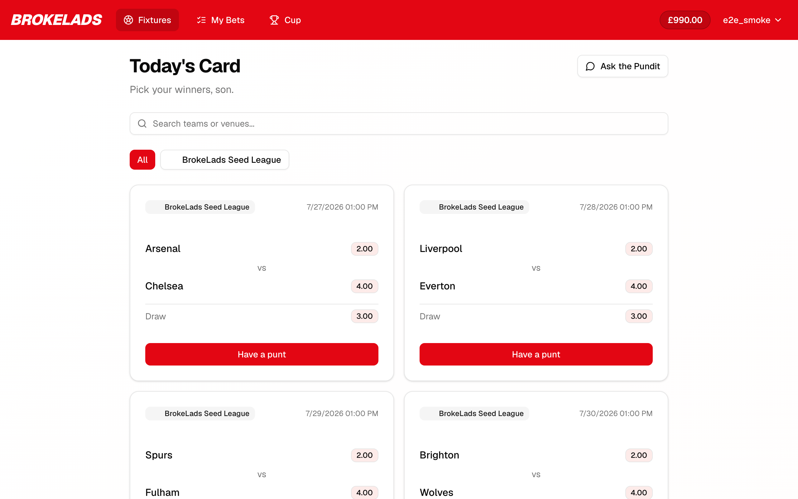

# bl-fe



Frontend for **BrokeLads**, a sports-betting demo app built around a weekly play-money cup.
Next.js 16 (App Router) + React 19 + TypeScript, talking to the `brokelads_cloud` API over REST.

The backend is a separate repo: **[joshrobbinsuk/brokelads_cloud](https://github.com/joshrobbinsuk/brokelads_cloud)**
(FastAPI on Cloud Run + Neon Postgres). The two are independent checkouts that run and deploy
together.

**Package manager is npm.** `package-lock.json` is the real lockfile; `pnpm-lock.yaml` is a
92-byte stub, ignore it.

## What the app does

Cup weeks run Monday to Monday in Europe/London. Entering a week's cup grants a **£1000 pot** to
stake on that week's fixtures; the backend settles the bets from live match results, and the
biggest pot at the end of the week wins the cup. Come Monday everyone is back to £1000.

- **Fixtures** (`/fixtures`) — the week's bettable matches with decimal odds for home, away and
  draw, filtered by a debounced team/venue search and by league pills. Betting happens in a
  dialog on each card.
- **My Bets** (`/my-bets`) — the user's bets with a debounced search and All / Pending / Won /
  Lost tabs.
- **Cup** (`/cup`) — the weekly leaderboard, with a week selector for past cups. Rows carry a 🏆
  lifetime cup-wins count (plus a 🏆 marker on the winner of a settled cup), a 🔥 participation
  streak and a 💰 profit streak.
- **Profile** (`/profile`) — the same three stats for the signed-in user, plus changing the
  display name.
- **Ask the Pundit** (`/pundit`, plus a drawer on desktop `/fixtures`) — a streaming chat with a
  cockney betting-tipster persona that reasons over the visible fixture slate and the user's
  recent bets.
- **Auth** (`/login`, `/signup`, `/forgot-password`, `/auth/action`) — email/password and Google
  sign-in, plus a branded landing page for the password-reset email link.

## Stack

| Concern | Choice |
| --- | --- |
| Framework | Next.js 16, App Router, React 19 |
| Data layer | Redux Toolkit + **RTK Query**, one API slice as the only backend boundary |
| Auth | Firebase web SDK against GCP Identity Platform; Auth emulator locally |
| Styling | Tailwind v4 (CSS-first config, no `tailwind.config.js`) + shadcn/ui on Radix |
| Tests | Playwright smoke specs in `e2e/`; no unit test framework |
| Hosting | Vercel (`@vercel/analytics` wired in) |

The app was scaffolded from a v0 template, so `package.json` still carries unused dependencies
(recharts, embla-carousel, react-hook-form, zod, date-fns and most of the Radix set). Only the 14
components actually present in `components/ui/` are in play.

## Layout

```
app/
  (auth)/          login, signup, forgot-password — wrapped by AuthRedirect
  (protected)/     fixtures, my-bets, cup, profile, pundit, welcome — wrapped by RouteGuard + UsernameGate
  auth/action/     password-reset landing page for the emailed ?mode=resetPassword&oobCode=… link
  layout.tsx       Redux provider, toaster, fonts, analytics
  page.tsx         redirects / -> /fixtures
  globals.css      Tailwind v4 config and the OKLch theme variables
components/
  auth/            login/signup/reset forms, google-button, route-guard, auth-redirect, username-gate
  fixtures/        fixture-card, bet-dialog, league-filter
  bets/            bet-card
  cup/             cup-leaderboard, streak-badges, week-selector
  pundit/          pundit-chat, pundit-chat-provider, pundit-drawer
  layout/          app-nav, wordmark
  providers/       redux-provider
  ui/              shadcn/ui (new-york style), generated
lib/
  services/        betting-api.ts — the RTK Query API slice
  firebase.ts      Firebase app + `auth` export, emulator wiring
  store.ts         Redux store
  money.ts         formatMoney() — Decimal-as-string -> GBP
  pundit-stream.ts SSE parsing for the pundit chat
hooks/             use-auth, use-toast, use-debounced-value, use-mobile
e2e/               Playwright smoke specs + emulator/login helpers
```

Path alias `@/*` maps to the repo root, so imports read `@/components/...`, `@/lib/...`.

## Data layer

All backend access goes through the single RTK Query slice in `lib/services/betting-api.ts`. Add
new endpoints there rather than ad-hoc `fetch`. It maps 1:1 to the backend's `/client/*` routes:

| Hook | Request |
| --- | --- |
| `useGetMeQuery` | `GET /client/me` |
| `useGetFixturesQuery` | `GET /client/fixture?search=&league_id=` |
| `useGetLeaguesQuery` | `GET /client/league` (active leagues only) |
| `useGetUserBetsQuery` | `GET /client/bet?outcome=&search=` |
| `useGetCupCurrentQuery` | `GET /client/cup/current` |
| `useGetCupQuery` | `GET /client/cup/{id}` |
| `useGetCupsQuery` | `GET /client/cups` |
| `useCreateBetMutation` | `POST /client/bet` |
| `useSetUsernameMutation` | `PUT /client/me/username` |

Cache tags are `Fixtures`, `Bets`, `User`, `Leagues`, `Cup`; placing a bet invalidates `Bets`,
`User` and `Cup`.

`prepareHeaders` awaits `auth.authStateReady()` and then attaches
`Authorization: Bearer <idToken>` from `auth.currentUser?.getIdToken()` — the await matters,
because on a hard reload queries otherwise fire before Firebase restores the persisted session
and cache a 401.

**Money fields (balance, stake, returns, odds) are strings end to end.** The backend serializes
`Decimal` as a string; render them through `formatMoney()` and do not coerce to `number` for
maths without care.

There is no other client state: no Redux feature slices, no Context or Zustand beyond the pundit
conversation. RTK Query's cache plus `useAuth()` is the whole story.

### Two structural things worth knowing

- **`PunditChatProvider` sits above the gates.** In `app/(protected)/layout.tsx` it wraps
  `RouteGuard` and `UsernameGate`, because those conditionally render their children — mounted
  below them, the provider would unmount and lose the conversation on every navigation. It
  therefore survives client-side navigation between `/pundit`, the desktop drawer and other
  protected pages, and resets on hard reload or logout.
- **`UsernameGate` is the first-run gate.** A user with `username === null` is redirected to
  `/welcome` to pick one, and anyone who already has one is kept off that page. The `setUsername`
  mutation patches `getMe`, so the gate owns the redirect back to `/fixtures`.

## Local development

```bash
npm ci
npm run dev          # http://localhost:3000
```

You need the backend stack up first — `docker-compose up` in `brokelads_cloud` gives you the API
on `:8000` and the **Firebase Auth emulator** on `:9099`. Sign-up and login write to the
emulator, so no real emails are sent and the accounts are throwaway. The board starts empty —
run the backend's dev seeder (`src.dev.seed all`, see its README) to get fixtures, odds and bets.

Create `.env.local` (none is committed). Because local auth is the emulator, the Firebase values
are placeholders it accepts — no real project credentials needed:

```
NEXT_PUBLIC_API_URL=http://localhost:8000
NEXT_PUBLIC_FIREBASE_API_KEY=fake-api-key
NEXT_PUBLIC_FIREBASE_AUTH_DOMAIN=demo-brokelads.firebaseapp.com
NEXT_PUBLIC_FIREBASE_PROJECT_ID=demo-brokelads
NEXT_PUBLIC_FIREBASE_AUTH_EMULATOR_HOST=http://localhost:9099
```

`lib/firebase.ts` connects the SDK to the emulator whenever
`NEXT_PUBLIC_FIREBASE_AUTH_EMULATOR_HOST` is set; it is set only in `.env.local` and never in the
cloud.

## Scripts and gates

```bash
npm run lint         # eslint 9 flat config — CI gate
npm run typecheck    # tsc --noEmit — CI gate
npm run build        # next build
npm run start        # serve the production build
npm run test:e2e     # Playwright smoke specs against a running local stack
```

`lint` and `typecheck` both run on every PR into `dev` (`.github/workflows/typecheck.yml`) and are
the only automated gates.

**`next.config.mjs` sets `typescript.ignoreBuildErrors: true`, so the build will not fail on type
errors.** Run `npm run typecheck` yourself before calling a change done. `images.unoptimized` is
also on.

### Tests

There is no unit test framework. Verification is `npm run typecheck` plus running the app, backed
by two Playwright smoke specs in `e2e/`:

- `cup.smoke.spec.ts` — logs in, places a bet, and asserts the pot and the cup leaderboard update.
- `auth-reset.smoke.spec.ts` — requests a reset link, sets a new password through
  `/auth/action`, and logs in with it.

Both need the local stack (API, Postgres, Auth emulator) up and seeded. Credentials come from
`.env.e2e` — gitignored, read only by the Playwright runner, deliberately **not** prefixed
`NEXT_PUBLIC_` so the password can never be inlined into the client bundle. `e2e/global-setup.ts`
idempotently seeds the test user into the Auth emulator and no-ops when the emulator is not
reachable.

## Conventions and gotchas

- `eslint-config-next` 16 ships a native flat config — spread its default export directly. Do
  **not** wrap it in `FlatCompat`; that crashes with a circular-JSON error.
- react-hooks v7 rules (React Compiler) are strict. `useAuth`'s mount-time subscription carries a
  single inline `eslint-disable` with a stated reason; prefer fixing at the source over muting.
- shadcn components in `components/ui/` are generated — extend via `components.json` / the CLI
  rather than hand-editing where you can.
- Tailwind v4 has no JS config file; theme tokens are OKLch custom properties in
  `app/globals.css`.
- `next.config.mjs` rewrites `/__/auth/*` to the Firebase-hosted auth handler so the Google
  sign-in popup runs from our own domain rather than a `firebaseapp.com` one.
- The pundit chat is the one deliberate exception to "everything through RTK Query": it needs a
  streaming response, so `lib/pundit-stream.ts` uses a manual `fetch` against
  `POST /client/pundit`, reusing `NEXT_PUBLIC_API_URL` and the same Firebase idToken. No extra
  environment variable is needed; the backend needs `OPENAI_API_KEY` for live replies.

## Deploy and branches

Default branch is **`dev`** — it is Vercel's production branch, and there is no `main`. Feature
branches are `feature/<slug>`.

The build runs on Vercel via the git integration. The **production environment variables are not
set here**: `brokelads_cloud`'s Terraform deploy writes `NEXT_PUBLIC_API_URL` (the Cloud Run URL)
and the three `NEXT_PUBLIC_FIREBASE_*` values (Identity Platform API key, auth domain, project
id) into the Vercel project and then fires a deploy hook. A backend redeploy therefore re-wires
*and* rebuilds this app with nothing pasted by hand. `NEXT_PUBLIC_FIREBASE_AUTH_EMULATOR_HOST` is
never set in the cloud. Local dev keeps using the gitignored `.env.local`.
